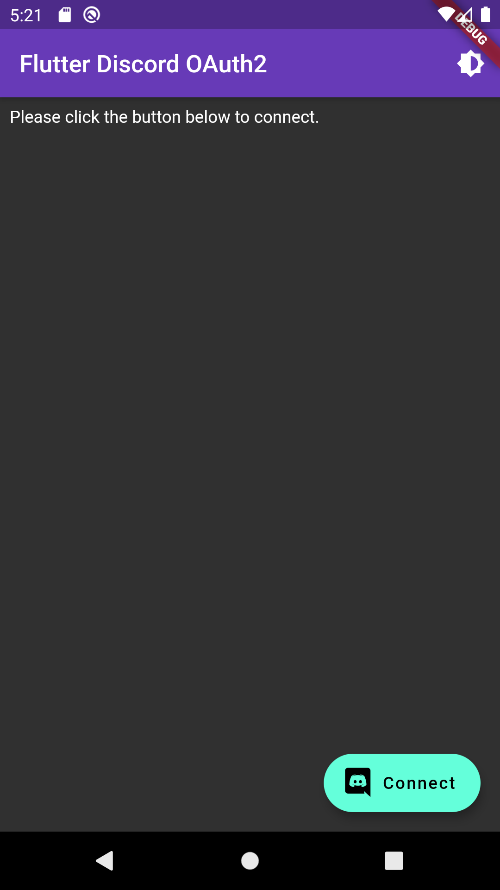
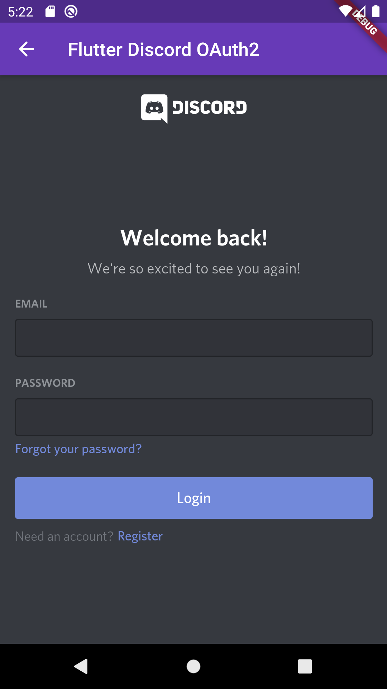
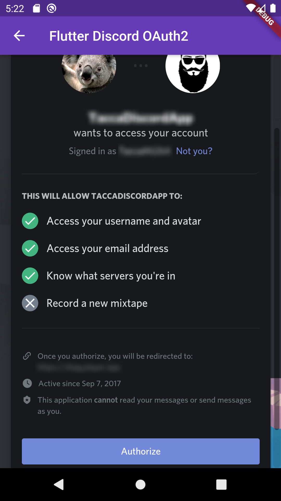
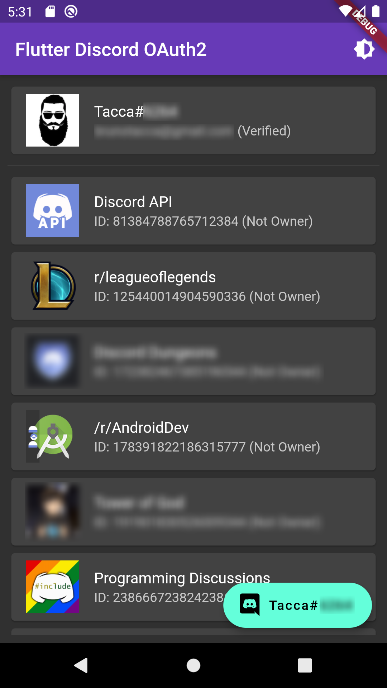

# Example of Discord's OAuth2 - User API

Example project using Flutter and MobX to authenticate an user with Discord's OAuth2 flow. Since the User Token has just few uses according to the docs, it just shows the User Info and the Guilds Info.

It is easily customizable to any OAuth2 services implementing PKCE.

It can save the credentials via SharedPreferences (no need to login again) along with a cool theme switcher (light/dark) and a custom discord icon.

There are better ways to store your app credentials, I do NOT recommend using this model to publish your app.

## Information Sources:

Discord OAuth2 Docs: https://discord.com/developers/docs/topics/oauth2

Discord Application Page: https://discord.com/developers/applications

Flutter Docs: https://flutter.dev/docs

Dart OAuth2: https://pub.dev/packages/oauth2

Flutter MobX: https://pub.dev/packages/mobx

Flutter Webview: https://pub.dev/packages/webview_flutter

## Cool Screenshots

   
